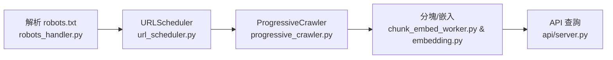

# Agentic RAG 系統

這是一個實驗性的 Retrieval-Augmented Generation 專案，透過「漸進式抓取」與向量化搜尋為語言模型補充外部知識。

## ✨ 特色
- **漸進式抓取**：依據 `robots.txt` 規範，在允許的範圍內分批抓取內容，避免一次性全量下載。
- **模組化設計**：爬蟲、向量化與資料儲存皆以獨立模組呈現，方便維護與擴充。
- **PostgreSQL 儲存**：以原生 PostgreSQL 作為主要資料庫，提高寫入效率。
- **可選 Supabase 遷移**：透過 `make migrate-supabase` 將資料匯入 Supabase 以享受託管服務。

## 📁 專案結構
```
agentic_rag/
├── database/        # PostgreSQL 客戶端與操作
├── embedding/       # 向量嵌入服務
├── spider/          # 網頁爬蟲與解析工具
├── scripts/         # 指令腳本與資料庫維護工具
└── Makefile         # 常用指令入口
```

## 🏗️ 架構

- `spider/crawlers/robots_handler.py`：解析 `robots.txt` 並快取允許與限制規則。
- `spider/crawlers/url_scheduler.py`：以資料庫維護待爬佇列與狀態。
- `spider/crawlers/progressive_crawler.py`：依排程批次抓取頁面內容。
- `spider/workers/chunk_embed_worker.py`：將文章分塊後計算向量嵌入。
- `embedding/embedding.py`：封裝嵌入模型以產生向量。
- `api/server.py`：對外提供查詢與回應服務。

## ⚙️ 環境設定
1. 複製範本：`cp .env.template .env`
2. 編輯 `.env`，設定 PostgreSQL 連線資訊與模型名稱，例如：
   ```env
   DB_HOST=localhost
   DB_PORT=5432
   DB_USER=postgres
   DB_PASSWORD=你的資料庫密碼
   DB_NAME=postgres
   EMBEDDING_MODEL=BAAI/bge-large-zh-v1.5
   ```

## 🚀 常用指令
所有流程皆透過 `Makefile` 管理：

| 指令 | 說明 |
|------|------|
| `make discover DOMAIN=https://example.com` | 解析 sitemap 並寫入待爬取 URL |
| `make crawl DOMAIN=https://example.com BATCH_SIZE=10` | 依據資料庫中的 URL 進行內容抓取 |
| `make embed LIMIT=100` | 為新文章產生向量嵌入 |
| `make search QUERY="關鍵問題"` | 進行語義搜尋 |
| `make migrate-supabase` | 將 PostgreSQL 資料遷移至 Supabase |

## 🌐 API 伺服器
啟動開發伺服器：

```bash
uvicorn api.server:app --reload
```

呼叫範例：

```bash
curl -X POST "http://localhost:8000/rag/query" \
  -H "Content-Type: application/json" \
  -d '{"question": "RAG 是什麼？"}'
```

## 🔁 一鍵全自動流程
若想從發現到向量化一次完成，可執行下列指令：

```bash
python -m scripts.auto_pipeline --domain https://example.com --batch_size 100
```

如需長時間執行，可加上 `--schedule 3600` 以每小時重新流程。

## 🪵 日誌
執行上述指令或單獨呼叫腳本時，系統會在 `logs/` 目錄生成 `<腳本名稱>.log` 等日誌檔。
例如可透過以下指令即時查看執行狀況：

```bash
tail -f logs/discover.log
```

## 🕷️ 爬蟲流程



1. `spider/crawlers/robots_handler.py` 解析 `robots.txt` 並取得 sitemap。
2. `spider/crawlers/url_scheduler.py` 將允許的 URL 寫入資料庫等待處理。
3. `spider/crawlers/progressive_crawler.py` 依排程抓取頁面內容。
4. `spider/workers/chunk_embed_worker.py` 透過 `embedding/embedding.py` 將內容分塊並計算向量。
5. `api/server.py` 使用嵌入執行語意搜尋並回應查詢。

## 🔄 遷移至 Supabase
若需將資料同步到 Supabase，可執行：
```bash
make migrate-supabase
```
此指令會呼叫 `scripts/database/migrate_to_supabase.py`，示範如何從本地 PostgreSQL 讀取資料並寫入 Supabase。可依需求擴充遷移邏輯。

## 🧪 測試
在執行測試前請先準備 `.env` 並安裝依賴：

```bash
cp .env.template .env
make install
```

完成後執行：

```bash
make test
```

上述指令會一次跑完 `scripts/`、`spider/tests` 等目錄的所有測試。

---
如有建議或問題，歡迎提出 Issue，一同改進這個實驗專案。
