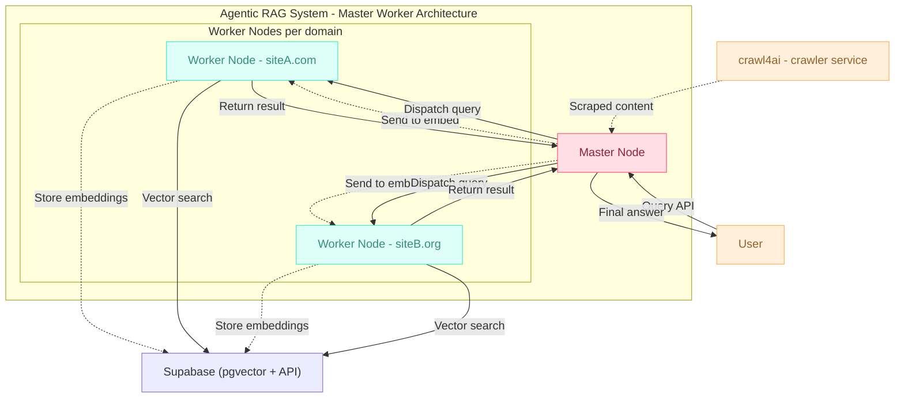

# 🤖 Agentic RAG Framework

[](https://opensource.org/licenses/MIT)
[](https://www.python.org/downloads/)
[](https://www.docker.com/)
[](https://supabase.com/)

**一個專為構建智能代理而設計的、可擴展的、生產級的檢索增強生成 (RAG) 框架。**

Agentic RAG 框架提供了一套完整的工具鏈，從網路數據的自動爬取、智能處理，到高效的向量化存儲和檢索，為開發先進的 AI 應用提供了堅實的後端基礎。

## 📋 項目概述

本框架專為智能代理開發而設計，整合了網路爬蟲、文本處理、向量存儲和智能檢索功能，提供企業級的 RAG 解決方案。通過深度整合 Supabase 的強大功能，實現了數據處理到檢索的完整閉環。

## 🎯 核心特性

-   **🌐 智能網路爬蟲**: 基於 `crawl4ai`，支援 Sitemap 解析、robots.txt 遵循、併發爬取和適應性速率限制，可高效抓取大規模網站。
-   **🧩 彈性文本處理**: 提供多種文本分塊策略（滑動窗口、語義分塊、句子分塊等），並自動計算內容雜湊以實現快取和數據去重。
-   **🗄️ 高效向量存儲**: 深度整合 `Supabase` (PostgreSQL + pgvector)，利用 HNSW 索引實現毫秒級的向量相似度搜尋。
-   **⚙️ 資料庫即服務 (DB as a Service)**: 將複雜的查詢、過濾和管理邏輯封裝為資料庫函數 (RPC)，並通過 Supabase API 公開訪問。
-   **🐳 全容器化部署**: 使用 Docker 和 Docker Compose 提供一鍵式的開發與生產環境部署方案。
-   **⚡ 異步優先架構**: 從爬蟲到資料庫操作，全面採用異步設計，最大化系統吞吐量。
-   **🛡️ 企業級資料庫設計**: 結構化的 SQL Schema、觸發器、索引和完善的權限管理，確保資料的完整性與安全性。
-   **🔐 Supabase 權限管理**: 為 `anon` 和 `authenticated` 角色提供精細化的表格和函數權限，確保 API 安全訪問。

## 🏗️ 系統架構

本框架採用模組化設計，主要由兩大容器協同工作，實現了應用邏輯與數據存儲的解耦。



### 容器化架構

```
┌─────────────────────┐    ┌─────────────────────┐
│   應用容器 (Python)  │    │  Supabase 數據容器   │
│                     │    │   (PostgreSQL)      │
│                     │◄──►│                     │
│ • Spider Framework  │    │ • PostgreSQL 15+    │
│ • Text Processing   │    │ • pgvector Extension │
│ • Embedding Model   │    │ • RPC Functions      │
│ • RAG Pipeline      │    │ • REST API          │
│ • Rate Limiting     │    │ • Row Level Security │
└─────────────────────┘    └─────────────────────┘
  host.docker.internal      localhost:8000
```

-   **應用容器**: 負責執行爬蟲、文本處理、模型嵌入等計算密集型任務。
-   **數據容器**: 專職負責數據的高效存儲、索引和檢索，通過 Supabase API 提供公開訪問。

## 📁 項目結構

```
Agentic-Rag/
├── 📁 spider/                 # 網路爬蟲模組
│   ├── crawlers/              # 爬蟲實現
│   │   ├── web_crawler.py     # 基於 crawl4ai 的高性能爬蟲
│   │   ├── simple_crawler.py  # 簡化版爬蟲，整合數據庫操作
│   │   ├── sitemap_parser.py  # Sitemap 解析和 URL 提取
│   │   └── fixed_sitemap_parser.py # 修復版 Sitemap 解析器
│   ├── chunking/              # 文本分塊策略
│   │   ├── base_chunker.py    # 基礎分塊器抽象類
│   │   ├── sliding_window.py  # 滑動窗口分塊，保持上下文
│   │   ├── sentence_chunking.py # 基於句子邊界的智能分塊
│   │   ├── semantic_chunking.py # 語義相似度分塊 (實驗性)
│   │   └── chunker_factory.py # 分塊器工廠模式
│   └── utils/                 # 工具模組
│       ├── rate_limiter.py    # 令牌桶算法限速器
│       └── retry_manager.py   # 指數退避重試機制
│   └── README.md              # Spider 模組使用指南
├── 📁 database/               # 資料庫模組
│   ├── client.py              # Supabase 客戶端封裝
│   ├── models.py              # 資料模型定義
│   ├── operations.py          # 資料庫操作封裝
│   ├── manage.py              # 資料庫管理工具
│   ├── sql/                   # SQL Schema 文件
│   │   ├── schema_all.sql     # 完整的資料庫 Schema (推薦使用)
│   └── README.md              # Database 模組使用指南
├── 📁 scripts/                # 工具腳本
├── 📁 embedding/              # 嵌入模型模組
│   └── embedding.py           # 向量嵌入管理器
├── 📄 config.json.template    # 配置文件模板
├── 📄 config_manager.py       # 配置管理器
├── 📄 ENV_SETUP.md           # 環境變數設置指南
├── 📄 Makefile                # 自動化指令
├── 📄 requirements.txt        # Python 依賴清單
├── 📄 docker-compose.yml      # Docker 編排配置
└── 📄 readme.md               # 本文件
```

## 🚀 快速開始

### 1. 環境配置

本項目已移除 .env 文件依賴，使用環境變數和 JSON 配置文件：

#### 設置必需的環境變數：
```bash
export SUPABASE_URL="your_supabase_url"
export ANON_KEY="your_supabase_anon_key"
export SERVICE_ROLE_KEY="your_supabase_service_role_key"  # 可選
```

#### 可選配置：
```bash
export TARGET_URLS="https://example.com,https://example2.com"
export CRAWLER_DELAY=2.5
export CRAWLER_MAX_CONCURRENT=10
```

詳細設置指南請參考 [ENV_SETUP.md](ENV_SETUP.md)

### 2. 安裝依賴

```bash
pip install -r requirements.txt
```

### 3. 測試配置

```bash
python test_no_env.py
```

### 4. 運行爬蟲

```bash
# 使用 make 指令 (推薦)
make spider

# 或直接運行
python -m spider.rag_spider
```


## 💡 使用範例
### 網站爬蟲腳本範例

以下腳本可協助自動化從 `robots.txt` 解析多個 Sitemap，並依照順序將結果記錄至資料庫：

```bash
# 1. 取得 robots.txt 並解析所有 Sitemap
python scripts/getSiteMap.py --url https://example.com

# 2. 根據 Sitemap 依序提取所有可爬取的 URL
python scripts/getUrls.py --sitemap-list sitemaps.txt

# 3. 對每個 URL 進行分塊處理
python scripts/getChunking.py --url-list urls.txt

# 4. 將分塊內容嵌入向量並記錄至資料庫
python scripts/getEmbedding.py --chunk-list chunks.txt
```

> 所有腳本皆可配合 `make` 指令執行，例如：`make get-sitemap`、`make get-urls` 等，詳見 `scripts/` 目錄下的說明。

#### 流程說明

1. **getSiteMap.py**  
  解析 robots.txt，獲取所有 Sitemap，並依 robots.txt 順序輸出。
2. **getUrls.py**  
  依照 Sitemap 順序提取 URL，確保爬取順序與 robots.txt 記錄一致。
3. **getChunking.py**  
  對每個 URL 內容進行分塊，便於後續嵌入與儲存。
4. **getEmbedding.py**  
  將分塊內容嵌入向量，並依順序寫入資料庫，方便檢索與追蹤。

> 所有步驟均可自動化串接，確保資料流與順序與原始 robots.txt/Sitemap 記錄一致。


## 📊 監控與效能


## 🚀 部署指南


## 🤝 貢獻指南

歡迎貢獻！請遵循以下步驟：

1. **Fork 專案**
2. **創建功能分支** (`git checkout -b feature/amazing-feature`)
3. **提交變更** (`git commit -m 'Add amazing feature'`)
4. **推送到分支** (`git push origin feature/amazing-feature`)
5. **開啟 Pull Request**

### 程式碼風格
- 使用 `black` 格式化 Python 程式碼
- 遵循 PEP 8 風格指南
- 為新功能添加適當的測試
- 更新相關文件

## 📄 授權條款

本專案採用 MIT 授權條款 - 詳見 [LICENSE](LICENSE) 文件

## 🆘 支援與問題回報

- **問題回報**: [GitHub Issues](https://github.com/your-username/agentic-rag/issues)
- **功能建議**: [GitHub Discussions](https://github.com/your-username/agentic-rag/discussions)
- **文件問題**: 歡迎直接提交 PR 改善

